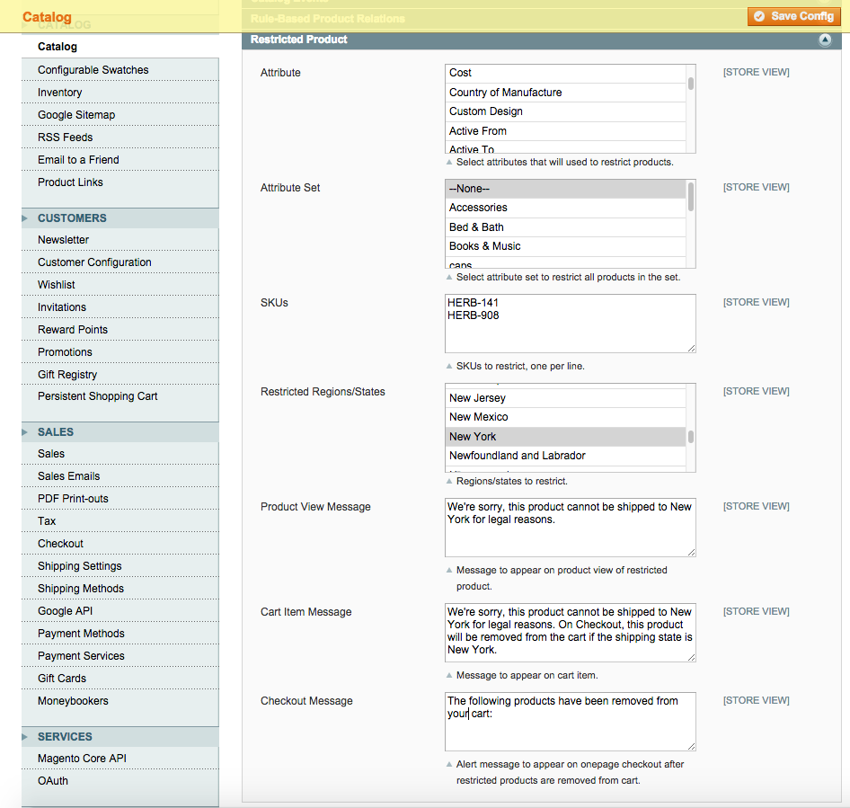
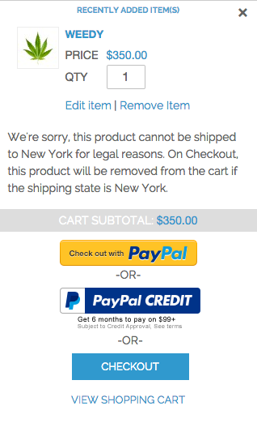
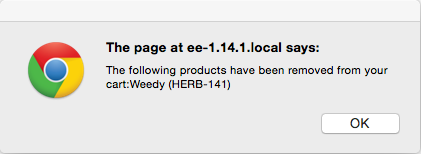

Restricted Product
==================
Restrict products from being shipped to specific regions.

Description
-----------
Restrict shipping a product to a specific region(s). If the user has an IP address in the region(s),
they can be shown a message on the product view and cart item that the product is flagged. If they
try to checkout with a shipping address in the restricted region, the product will be removed 
from their cart.

How to use
----------

Upload the extension files to your server. In the admin under System -> Configuration -> Catalog -> 
Catalog -> Restricted Product, configure the extension:

On the front end, the flagged product will show on the product view and checkout cart:

On checkout, if the shipping region/state is the restricted region(s), restricted products will be 
removed from the user's cart:

